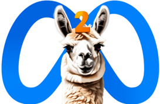
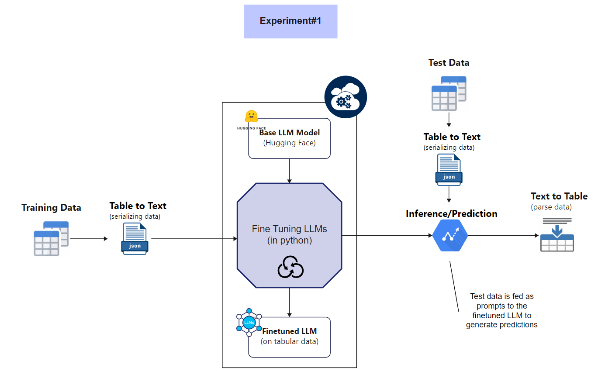
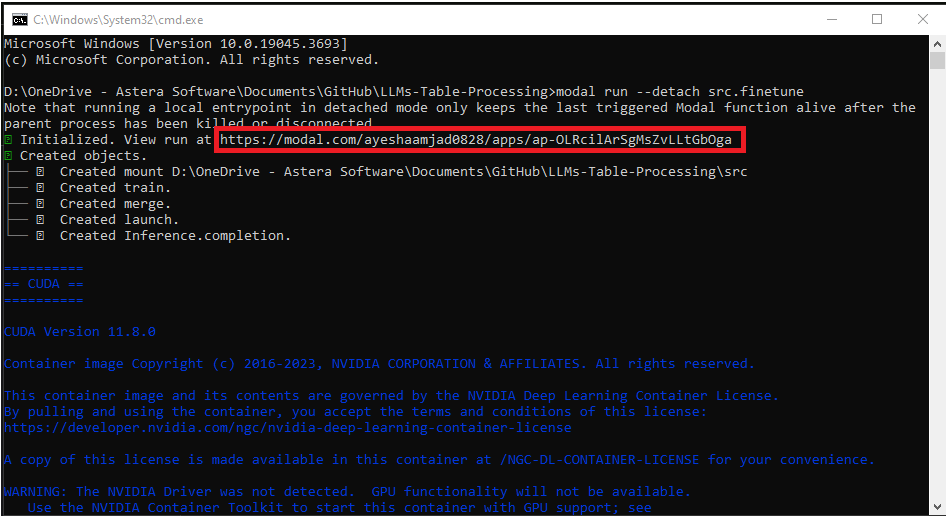
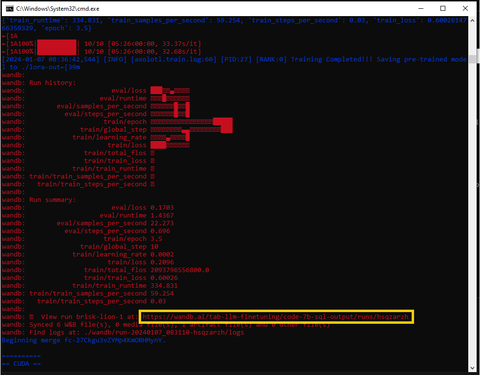
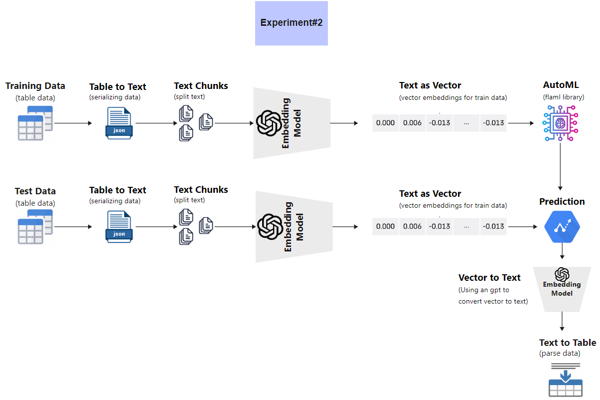
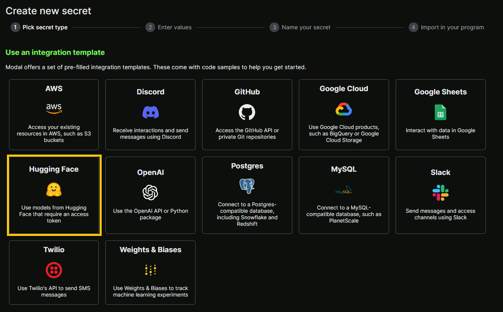
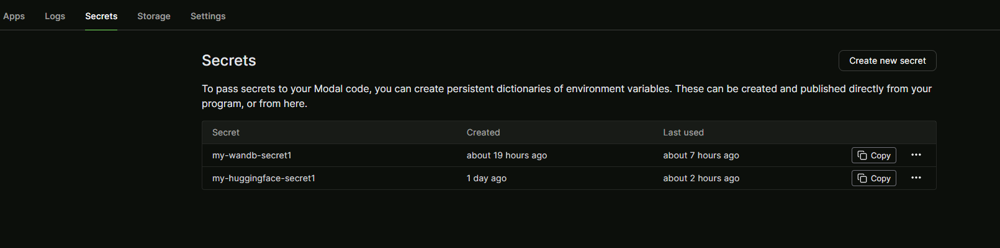
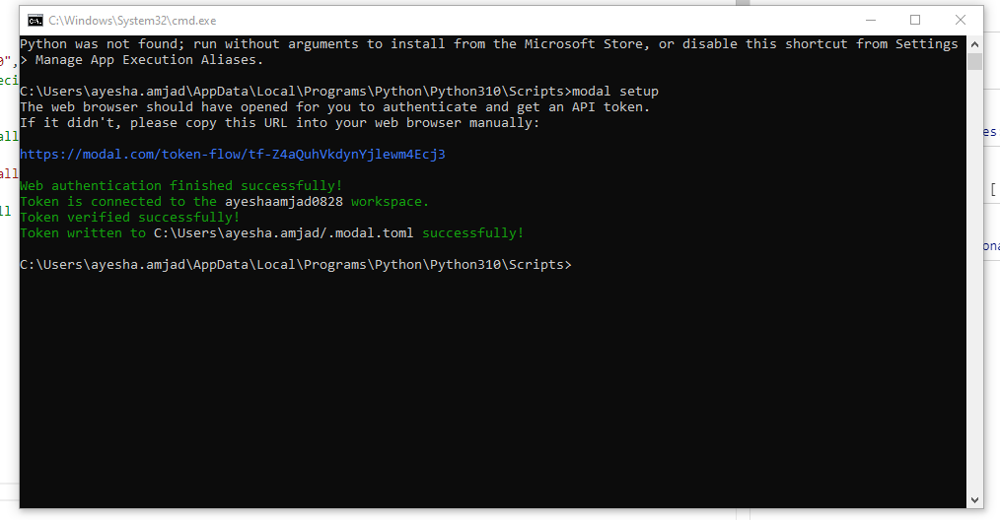

# Using LLMs to Predict on Tabular Data
## Finetuning LLMs to predict on some of the popular Kaggle datasets. 

> Refer to the [pre-requisites]([AyeshaAmjad0828/LLMs-Table-Predictions: Training LLMs on some of the popular kaggle datasets (github.com)](https://github.com/AyeshaAmjad0828/LLMs-Table-Predictions?tab=readme-ov-file#pre-requisites)) section for the environment set up prior to starting this experiment.

### Technology Stack

| Hugging Face                          | Axolotl                                                      | Modal                                                        | Llama                                                        | OpenAI                                                       | Weights&Biases                                          |
| ------------------------------------- | ------------------------------------------------------------ | ------------------------------------------------------------ | ------------------------------------------------------------ | ------------------------------------------------------------ | ------------------------------------------------------- |
|  |  |  |  |  |  |

### Overview

The objective of this project is to assess the quality of LLM training and predictions results on tabular datasets. The inspiration is drawn from [clinicalml/TabLLM (github.com)](https://github.com/clinicalml/TabLLM) which performed few-shot classification of tabular data with LLMs. 

The project consists of two experiments:

1. Finetuning an LLM on serialized training data and using it to generate predictions on test dataset. 
2. Generating vector embeddings on serialized training data and using the vectors as features for an AutoML algorithm(FLAML). 

Let's go over the design and execution of each experiment in a step by step manner. 

### Experiment 1 - Finetuning an LLM

Here is an a diagram showing a high-level set up of the first experiment.



This experiment contains three steps:

1. Serializing the data (both train and test) from table to text. (list serialization, text template, manual template)
2. Finetuning an LLMs (Llama-7B, Llama-13b, Llama 70b). All logic related to finetuning is in src/finetune.py
3. Perform inference/prediction on test data using finetuned model. All logic related to inference is in src/inference.py

#### Table to Text

Three ways are used for converting tabular data into a text strings. The most promising results were given by manual conversion and [bloom-560m-finetuned-totto-table-to-text](https://huggingface.co/Narrativaai/bloom-560m-finetuned-totto-table-to-text). 

The text sentences are then manually labeled (using expressions) as input for features and output for target variable value compatible with a jsonl file structure. The subset of final dataset is added to [my_data.jsonl](https://github.com/AyeshaAmjad0828/LLMs-Table-Predictions/blob/main/src/my_data.jsonl). 

> The actual fraud.jsonl used for the training contains 1,296,675 records. 

#### Finetuning Llama7B/13b/70b

The src/finetune.py runs three business modal functions in cloud:

1. `launch` prepares a new folder in the `/runs` volume with the training config and data for a new training job. It also ensures the base model is downloaded from HuggingFace.
2. `train` takes a prepared folder and performs the training job using the finalconfig.yml and my_data.jsonl
3. `Inference.completion` can spawn a [vLLM](https://modal.com/docs/examples/vllm_inference#fast-inference-with-vllm-mistral-7b) inference container for any pre-trained or fine-tuned model from a previous training job.

The rest of the code are helpers for *calling* these three functions. 

##### Config

Training job uses finalconfig.yml where training configurations are defined. Here is a breakdown of this file:

1. Base model

   The base_model value is changed for experimenting with different Llama models. 

   ```
   base_model: meta-llama/Llama-2-7b-chat-hf    #meta-llama/Llama-2-13b-chat-hf, #meta-llama/Llama-2-70b-chat-hf
   model_type: LlamaForCausalLM
   tokenizer_type: LlamaTokenizer
   is_llama_derived_model: true
   ```

2. Dataset

   The following format is set according to the layout of my_data.jsonl and the nature of the experiment. Different formats supported by axolotl can be found [here](https://github.com/OpenAccess-AI-Collective/axolotl#dataset). 

   ```
   datasets:
     - path: my_data.jsonl
       ds_type: json
       type:
         # JSONL file contains data, and output fields per line.
         # This gets mapped to input, output axolotl tags.
         field_input: data
         field_output: output
         # Format is used by axolotl to generate the prompt.
         format: |-
           [INST] For the given data values of trans_date_trans_time, cc_num, merchant, category, amt, first, last, gender, street, city, state, zip, lat, long, city_pop, job, dob, trans_num, unix_time, merch_lat, merch_long in input, what is the output value of is_fraud?
           {input}
           [/INST] 
   ```

3. Adapter

   ```
   adapter: lora
   lora_model_dir:
   lora_r: 16
   lora_alpha: 32 # alpha = 2 x rank is a good starting point.
   lora_dropout: 0.05
   lora_target_linear: true # target all linear layers
   lora_fan_in_fan_out:
   ```

4. Weights&Biases

   This will enable the tracking of all runs with weights and biases. During the training, a clickable link is generated for W&B dashboard. 

   ```
   wandb_project: tabllm-7b-prediction-output
   wandb_watch: all
   wandb_entity:
   wandb_run_id:
   ```

5. Multi-GPU training

   Used the recommended [DeepSpeed](https://github.com/microsoft/DeepSpeed) for multi-GPU training, which is easy to set up. Axolotl provides several default deepspeed JSON [configurations](https://github.com/OpenAccess-AI-Collective/axolotl/tree/main/deepspeed) and Modal makes it easy to [attach multiple GPUs](https://modal.com/docs/guide/gpu#gpu-acceleration) of any type in code. 

   ```
   deepspeed: /root/axolotl/deepspeed/zero3.json
   ```


##### Using CLI for finetuning

Navigate to the location containing src folder in CLI and start the finetuning with a simple command.

```
modal run --detach src.finetune
```

*`--detach` lets the app continue running even if the client disconnects*.

The script reads two local files: `finalconfig.yml` and `my_data.jsonl`. The contents passed as arguments to the remote `launch` function, which will write them to the `/runs` volume. Next, `train` will read the config and data from the new folder for reproducible training runs.

The default configuration fine-tunes meta-llama/Llama-2-7b-chat-hf with 20 epochs. It uses DeepSpeed ZeRO-3 to shard the model state across 2 A100s.

The command will first install all the required packages. Followed by creating objects for the function defined in `finetune.py`. 

A link to app logs maintained by modal is provided which stores information on cpu and gpu consumption. 



A link to weights and biases dashboard is also provided along with the info passed to it.



### Experiment 2 - LLM Vector Embeddings for AutoML

Here is an a diagram showing a high-level set up of the second experiment.



This experiment involves 3 steps
1. Data Serialization
   - **Method:** Manual Template
   - **Description:** Data is serialized using the Manual Template method. Sample file is [manual_template_serialization.jsonl](https://github.com/AzeemQidwai/LLMs-Table-Predictions/blob/azeem-main/serialization/serialized_dataset/manual_template_serialization.jsonl)

2. Embedding Vectors Generation
   - **Model:** OpenAI embedding model `text-embedding-ada-002`
   - **Description:** Embedding vectors are generated using the specified OpenAI model.

3. AutoML Evaluation
   - **Models:** AutoML class of `flaml`
   - **Description:** Embedded data is passed to the AutoML class for assessing the best-performing estimator and hyperparameter configuration.

#### Table to Text Serialization
   - **Method:** Manual Template
   - **Description:** Sentence-like strings of tabular data are created using the Manual Template method.

#### Embedding Vectors for ML Models
   - **Model:** OpenAI embedding model `text-embedding-ada-002`
   - **Description:** Sentences are embedded using the OpenAI model for ML model prediction.

#### AutoML Assessment
   - **Class:** AutoML class of `flaml`
   - **Description:** The embedded data is evaluated to determine the best estimator and hyperparameter configuration.


### Pre-requisites

#### Setting up accounts on Modal, Hugging Face, W&B

1. Create an account on [Modal](https://modal.com/).

2. Create an account on [Hugging face](https://huggingface.co/) and agree to the terms and conditions for accessing [Llama](https://huggingface.co/meta-llama/Llama-2-13b-chat-hf) models. 

3. Get the [hugging face access token](https://huggingface.co/settings/tokens). 

4. Create a new [secret](https://modal.com/ayeshaamjad0828/secrets) for hugging face in your modal account. This secret is a way to mask [hugging face access token](https://modal.com/ayeshaamjad0828/secrets). 

   

   Once created, your keys will be displayed in the same location. 
   

5. Install modal in your current python environment `pip install modal`.

6. Open cmd, navigate to python scripts folder  ...\AppData\Local\Programs\Python\Python310\Scripts

7.  Set up modal token in your python environment `modal setup`.

   

8. (Optional) To monitor LLM finetuning performance visually, set up a [weights and biases account](https://wandb.ai/home) , get its [authorize key](https://wandb.ai/authorize), and create its [secret](https://modal.com/ayeshaamjad0828/secrets) in the same way as hugging face secret on modal. 

   Install weights and biases library in your current python environment  `pip install wandb`

   Add your wandb config to your config.yml script (you will find this in my [finalconfig.yml](https://github.com/AyeshaAmjad0828/LLMs-Table-Predictions/blob/main/src/finalconfig.yml))

   ```
   wandb_project: tabllm-7b-prediction-output
   wandb_watch: all
   wandb_entity:
   wandb_run_id:
   ```

> you may have to perform modal setup again in your python environment as shown in step 7. 

#### Initializing Axolotl, Huggingface, and W&B applications

Script for initializing the required applications in modal is [common.py](https://github.com/AyeshaAmjad0828/LLMs-Table-Predictions/blob/main/src/common.py). This is where we define application name to be appeared in modal.

```
APP_NAME = "tablefinetune-axolotl"
```

Followed by axolotl image that fetches relevant hugging face model. 

```
axolotl_image = (
    Image.from_registry(f"winglian/axolotl@sha256:{AXOLOTL_REGISTRY_SHA}")
    .run_commands(
        "git clone https://github.com/OpenAccess-AI-Collective/axolotl /root/axolotl",
        "cd /root/axolotl && git checkout a581e9f8f66e14c22ec914ee792dd4fe073e62f6",
    )
    .pip_install("huggingface_hub==0.19.4", "hf-transfer==0.1.4")
    .pip_install(
        f"transformers @ git+https://github.com/huggingface/transformers.git@{TRANSFORMERS_SHA}",
        "--force-reinstall",
    )
    .env(dict(HUGGINGFACE_HUB_CACHE="/pretrained", HF_HUB_ENABLE_HF_TRANSFER="1"))
)

```

The stubs initialization for hugging face and w&b secret keys. 

```
stub = Stub(APP_NAME, secrets=[Secret.from_name("my-huggingface-secret1"), Secret.from_name("my-wandb-secret1")])
```

Finally, it defines volumes for pre-trained models and training runs. 

```
pretrained_volume = Volume.persisted("example-pretrained-vol")
runs_volume = Volume.persisted("example-runs-vol")
VOLUME_CONFIG: dict[str | os.PathLike, Volume] = {
    "/pretrained": pretrained_volume,
    "/runs": runs_volume,
}
```


